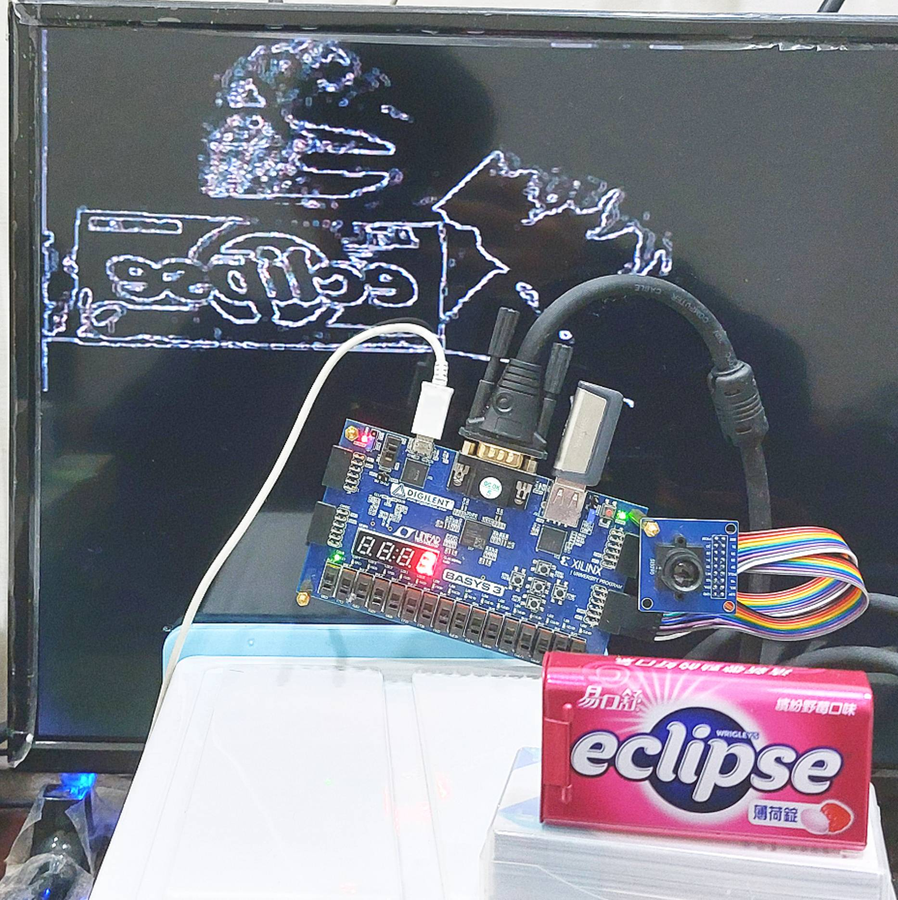
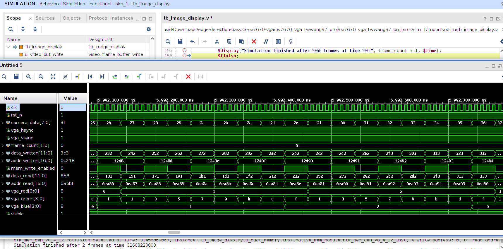

# FPGA Project: Edge Detection with Basys 3

* Title: **Real‑time FPGA edge detection pipeline on a Basys 3 using an OV7670 camera and VGA output**
* FPGA board Basys 3:  [Manual](https://digilent.com/reference/programmable-logic/basys-3/reference-manual) | [PDF](https://digilent.com/reference/_media/basys3:%20basys3_rm.pdf) | [JTAG-HS2](https://digilent.com/reference/_media/jtag_hs2:jtag-hs2_rm.pdf) | [Schematic](https://digilent.com/reference/_media/reference/programmable-logic/basys-3/basys-3_sch.pdf) | [Pinouts](https://www.nhn.ou.edu/~bumm/ELAB/Labs/Basys3_FGPA_pin_outs.pdf) | [XDC](https://digilent.com/reference/_media/basys3/basys3_master.zip)
* Camera: `OV7670` ([RGB565](./rtl/ov7670/ov7670_register_table.v#L45) is selected).
* Vivado Version: `2025.2`.


---

### VGA Display

In this project, four modes are presented:

* `Mode 0`: Color Bar
* `Mode 1`: RGB444
* `Mode 2`: Sobel Edge
* `Mode 3`: Weighted Edge Detection

(Detection in Mode 3 is better)

---

### How to run?

* Step 1. Configure your Vivado paths:
```
export XILINX_VIVADO=<path_to_dir>/Xilinx/2025.2/Vivado
export PATH=<path_to_dir>/Xilinx/2025.2/Vivado/bin:$PATH
```
Or, a better way to configure it by:
```
source <path_to_dir>/Xilinx/2025.2/Vivado/settings64.sh
```

* Step 2. Then, open the **Vivado** with
```
vivado
```

* Step 3. Click `Window` >> `Tcl Console` (shortcut: `Ctrl + Shift + T`), navigate to your Tcl Console, and type
```
source create_proj.tcl
```

* Step 4. Click `Generate Bitstream`. You will finally get a bitstream file (`*.bit`).
* Step 5. Program your FPGA board (Basys 3) and observe the edge detection similar to this [video](https://youtu.be/Ro8rp9voRJ4?t=93).

##### abbreviation

* XDC = Xilinx design constraints
* SCL = serial clock
* SDA = serial data
* VS = vertical sync
* HS = horozontal sync
* PLK = pixel clock output
* XLK = system clock input

---

### Simulation

* To start the simulation in Vivado (**xsim**), continue the following steps with your testbench `tb_image_display.v`.

* Step 6. Click `Run Simulation` and then wait a minute until the waveform is presented. Right click on the wave window and select `Full View`.



---

### Camera Connection

#### OV7670 (CMOS camera)

| basys3 | pins | ov7670# | pins | basys3 |
|-----|-----|-----|-----|-----|
| null | 3V3 | 01 02 | DGND | null |
| JC10 | SCL | 03 04 | SDA  | JC4 |
| JC9  | VS  | 05 06 | HS   | JC3 |
| JC8  | PLK | 07 08 | XLK  | JC2 |
| JC7  | D7  | 09 10 | D6   | JC1 |
| JB10 | D5  | 11 12 | D4   | JB4 |
| JB9  | D3  | 13 14 | D2   | JB3 |
| JB8  | D1  | 15 16 | D0   | JB2 |
| JB7  | RET | 15 16 | PWDN | JB1 |

#### JB

| JB# | xdc | pins | JB#  | xdc |
|---|---|---|---|---|
| JB1 | A14 | ◻◻ | JB7  | A15 |
| JB2 | A16 | ◻◻ | JB8  | A17 |
| JB3 | B15 | ◻◻ | JB9  | C15 |
| JB4 | B16 | ◻◻ | JB10 | C16 |
| JB5 | GND | ◻◻ | JB11 | GND |
| JB6 | PWR | ◻◻ | JB12 | PWR |

#### JC

| JC# | xdc | pins | JC#  | xdc |
|---|---|---|---|---|
| JC1 | K17 | ◻◻ | JC7  | L17 |
| JC2 | M18 | ◻◻ | JC8  | M19 |
| JC3 | N17 | ◻◻ | JC9  | P17 |
| JC4 | P18 | ◻◻ | JC10 | R18 |
| JC5 | GND | ◻◻ | JC11 | GND |
| JC6 | PWR | ◻◻ | JC12 | PWR |